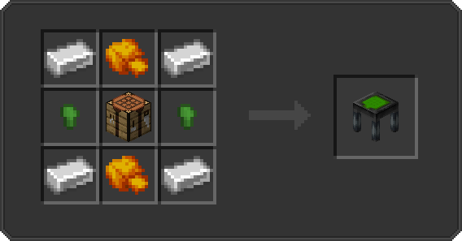

---
hide:
  - pageTitle
---

### Introduction

For all future recipes, we need a foundation to craft all machines, tools, blocks, etc.
But, we aren't using the normal crafting table, but a thorium crafting table!

Mostly all recipes are being crafted in the 5x5 crafting area!

**The [Just Enough Items](https://www.curseforge.com/minecraft/mc-mods/jei){:target=”_blank”}   Mod is highly recommended for crafting!**  
Otherwise, recipes can be seen in [Recipes](recipes.md)

 
[Next > Recipes](recipes.md){ .md-button }
  

### Thorium Crafting Table

Use the following recipe to craft a thorium crafting table!

 
Recipe:

 
Resources needed:

<table>
    <tr>
        <td> 4x Iron Ingot </td>
        <td> 2x Raw Thorium </td>
    </tr>
    <tr>
        <td> 2x Nickel Nugget </td>
        <td> 1x Crafting Table </td>
    </tr>
</table>

