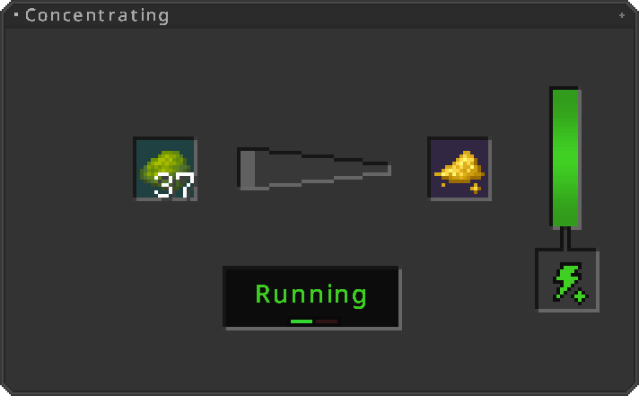

---
hide:
  - pageTitle
---

### Introduction

Have your [Thorium Crafting Table](http://127.0.0.1:8000/firststeps/#thorium-crafting-table) set up? Great!  
Now we will craft our first machines!  

You need one of each machine to successfully build a reactor and turbine!

**The [Just Enough Items](https://www.curseforge.com/minecraft/mc-mods/jei){:target=”_blank”}   Mod is highly recommended for crafting!**  
**Please manage to install JEI, since there are way to many Recipes to show all!**

 
[Next > Fuel Production](fuel.md){ .md-button }
  

### Controlling your Machine

There are some possibilities available to power control your machines!  
Firstly your can completely turn it off, by simply clicking the **"Power"** button on the left side of the machines inventory!  

Controlling it is also possible though redstone!  
Simply change the **"Redstone Mode"** beneath the **"Power"** button.

When using **"Ignored"** the machine is always powered, atleast until its **"Power"** is true.  
**"Normal"** means, it will run when an active redstone signal is applied into it, or on a surrounding block.  
Last but not least there's **"Inverted"**, which basically is like the **"Normal"** mode, but inverted.

### Machine Casing

You need this machine casing for crafting **all** machines!  
Crafting ingredient only!

### Fuel Generator

If you dont already have an energy generation from other mods, you will need a Fuel Generator!  
The fuel Generator burns **fossile fuels** and generates at a rate of **144FE/t**

??? success "Functionality"    
    
     
    By adding burnable fuel in the input slot, the generator will generate 144FE (Forge Energy) per Game Tick (20 times per second).
    When the internal energy buffer is filled, generation is not being stopped until it runs out of the currently burned fuel!

### Fluid Evaporator

Machine needed for fuel production.  
Gaining salt is this machines most use!  
Needs 142FE/t

??? success "Functionality"    
    
     
    Heats up fluids to their boiling point and evaporate them that way.  
    Excess debris like salts can be extracted this way!
    In this case water is being evaporated and Sodium is gained.

### Electrolytic Separator

Machine needed for fuel production.  
Uses eletrolysis on fluids to extract minerals.  
Needs 86FE/t

??? success "Functionality"    
    
     
    Uses eletrolysis on fluids to extract minerals.  
    Mostly used for water to gain potassium salts!
    Like in this case.

### Salt Melter

Machine needed for fuel production.  
Melts different salts into a homogeneous fluid!  
Needs 233FE/t

??? success "Functionality"    
    
     
    Uses extreme heat to melt multiple salts together.  
    Beforehand, it need to heat up to a recipe specified temperature, indicated by the Fan icon.  
    The reactors main fluid is made this way!

### Concentrator

Uses materials to form their high concentrated variants!  
Needs 64FE/t

??? success "Functionality"    
    
     
    Mostly used to produce yellow cake out of raw uranium.  
    First step of uranium enrichment!

### Decomposer

Decomposes items into a fluid.  
Needs 33FE/t

??? success "Functionality"    
    
     
    Injects decomposed items into a fluid.  
    Mostly used for hydrofluorite production!

### Uranium Oxidizer

Injecting minerals into fluids using oxidization.  
Needs 54FE/t

??? success "Functionality"    
    
     
    Oxidized resources as uranium and injects it into fluids.  
    Mostly used to produce Uranium Hexafluorite

### Fluid Centrifuge

Fluid manpulation using centrifuging  
Needs 46FE/t

??? success "Functionality"    
    
     
    High rotation modifies fluids by extracting elementary particles or substances. 
    Mostly used to enrich Uranium Hexafluorite!

### Crystallizer

Turns fluids into their solid form.  
Needs 54FE/t

??? success "Functionality"    
    
     
    Modifies fluids state of matter into their solid form.  

### Blast Furnace

Having an Blast Furnace is essential, its mostly used to produce Blasted Stone, Iron- and Steel Ingots  
Needs 189FE/t

??? success "Functionality"    
    
     
    Uses two ingredients to form them into one. In this case, Coal and Blasted Iron to produce Steel!  
    Beforehand, it need to heat up to a recipe specified temperature, indicated by the Fan icon.  
    Here it's 1050°C!

