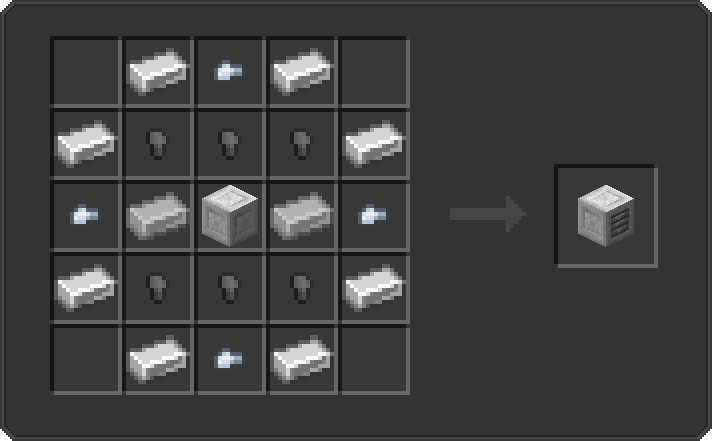

---
hide:
  - pageTitle
---

### Introduction

Need help in crafting all machines and ingredients?  
No problem! Head up to [Recipes](#all-recipes) and start crafting on all needed blocks for your own reactor!

**You can also use the [Just Enough Items](https://www.curseforge.com/minecraft/mc-mods/jei){:target=”_blank”}   Mod to see all recipes and progresses ingame!**

 
[Next > Machines](machines.md){ .md-button }
  

### Chest

#### Blasted Iron Chest
??? question "Show recipe"
    
     
    Resources needed:
    <table>
        <tr>
            <td> 8x Iron Ingot </td>
            <td> 4x Iron Nugget </td>
            <td> 4x Blasted Iron Nugget </td>
        </tr>
        <tr>
            <td> 4x Blasted Iron Ingot </td>
            <td> 1x Chest </td>
            <td>  </td>
        </tr>
    </table>

#### Steel Chest
??? question "Show recipe"
    
     
    Resources needed:
    <table>
        <tr>
            <td> 4x Steel Ingot </td>
            <td> 4x Blasted Iron Ingot </td>
            <td> 8x Blasted Iron Nugget </td>
            <td> 1x Cobalt Nugget </td>
        </tr>
        <tr>
            <td> 1x Steel Nugget </td>
            <td> 1x Blasted Iron Chest </td>
            <td> 1x Steel Block </td>
            <td>  </td>
        </tr>
    </table>
    
#### Thorium Chest
??? question "Show recipe"
    
     
    Resources needed:
    <table>
        <tr>
            <td> 4x Steel Ingot </td>
            <td> 4x Blasted Iron Ingot </td>
            <td> 8x Blasted Iron Nugget </td>
            <td> 1x Cobalt Nugget </td>
        </tr>
        <tr>
            <td> 1x Steel Nugget </td>
            <td> 1x Blasted Iron Chest </td>
            <td>  </td>
            <td>  </td>
        </tr>
    </table>

### Tanks

#### Simple Fluid Tank
??? question "Show recipe"
    
     
    Resources needed:
    <table>
        <tr>
            <td> 6x Iron Ingot </td>
            <td> 4x Steel Ingot </td>
            <td> 2x Cobalt Nugget </td>
        </tr>
        <tr>
            <td> 2x Redstone Dust </td>
            <td> 1x Bucket </td>
            <td>  </td>
        </tr>
    </table>

#### Generic Fluid Tank
??? question "Show recipe"
    
     
    Resources needed:
    <table>
        <tr>
            <td> 6x Iron Ingot </td>
            <td> 4x Steel Ingot </td>
            <td> 1x Nickel Nugget </td>
        </tr>
        <tr>
            <td> 1x Niob Nugget </td>
            <td> 2x Redstone Dust </td>
            <td> 1x Simple Fluid Tank </td>
        </tr>
    </table>

#### Progressive Fluid Tank
??? question "Show recipe"
    
     
    Resources needed:
    <table>
        <tr>
            <td> 6x Iron Ingot </td>
            <td> 4x Steel Ingot </td>
            <td> 1x Manganese Nugget </td>
        </tr>
        <tr>
            <td> 1x Molybdenum Nugget </td>
            <td> 2x Redstone Dust </td>
            <td> 1x Generic Fluid Tank </td>
        </tr>
    </table>

### Item Recipes

#### Configurator
??? question "Show recipe"
    
     
    Resources needed:
    <table>
        <tr>
            <td> 8x Iron Ingot </td>
            <td> 4x Gold Ingot </td>
            <td> 1x Aluminum Ingot </td>
            <td> 1x Steel Ingot </td>
        </tr>
        <tr>
            <td> 1x Blasted Iron Ingot </td>
            <td> 1x Redstone Dust </td>
            <td> 1x Redstone Processor </td>
            <td> 1x Cobalt Nugget </td>
        </tr>
        <tr>
            <td> 1x Fluorite Nugget </td>
            <td> 1x Niob Nugget </td>
            <td> 1x Manganese Nugget </td>
            <td>  </td>
        </tr>
    </table>
    
#### Empty Module
??? question "Show recipe"
    
     
    Resources needed:
    <table>
        <tr>
            <td> 8x Iron Ingot </td>
            <td> 4x Gold Ingot </td>
            <td> 4x Nickel Nugget </td>
            <td> 4x Redstone Dust </td>
            <td> 1x Redstone Processor </td>
        </tr>
    </table>
    
#### IO Module
??? question "Show recipe"
    
     
    Resources needed:
    <table>
        <tr>
            <td> 11x Iron Ingot </td>
            <td> 1x Gold Ingot </td>
            <td> 3x Nickel Nugget </td>
            <td> 4x Redstone Dust </td>
        </tr>
        <tr>
            <td> 1x Redstone Processor </td>
            <td> 1x Aluminum Ingot </td>
            <td> 1x Empty Module </td>
            <td> 1x Rail </td>
        </tr>
    </table>
    
#### Energy Module
??? question "Show recipe"
    
     
    Resources needed:
    <table>
        <tr>
            <td> 11x Iron Ingot </td>
            <td> 1x Gold Ingot </td>
            <td> 3x Nickel Nugget </td>
            <td> 4x Redstone Dust </td>
        </tr>
        <tr>
            <td> 1x Redstone Processor </td>
            <td> 1x Aluminum Ingot </td>
            <td> 1x Empty Module </td>
            <td> 1x Block of Redstone </td>
        </tr>
    </table>
    
#### Storage Module
??? question "Show recipe"
    
     
    Resources needed:
    <table>
        <tr>
            <td> 11x Iron Ingot </td>
            <td> 1x Gold Ingot </td>
            <td> 3x Nickel Nugget </td>
            <td> 4x Redstone Dust </td>
        </tr>
        <tr>
            <td> 1x Redstone Processor </td>
            <td> 1x Aluminum Ingot </td>
            <td> 1x Empty Module </td>
            <td> 1x Barrel </td>
        </tr>
    </table>

#### Tank Module
??? question "Show recipe"
    
     
    Resources needed:
    <table>
        <tr>
            <td> 11x Iron Ingot </td>
            <td> 1x Gold Ingot </td>
            <td> 3x Nickel Nugget </td>
            <td> 4x Redstone Dust </td>
        </tr>
        <tr>
            <td> 1x Redstone Processor </td>
            <td> 1x Aluminum Ingot </td>
            <td> 1x Empty Module </td>
            <td> 1x Bucket </td>
        </tr>
    </table>

#### Sensor Module
??? question "Show recipe"
    
     
    Resources needed:
    <table>
        <tr>
            <td> 11x Iron Ingot </td>
            <td> 1x Gold Ingot </td>
            <td> 3x Nickel Nugget </td>
            <td> 4x Redstone Dust </td>
        </tr>
        <tr>
            <td> 1x Redstone Processor </td>
            <td> 1x Aluminum Ingot </td>
            <td> 1x Empty Module </td>
            <td> 1x Cobalt Ingot </td>
        </tr>
    </table>

#### Processing Module
??? question "Show recipe"
    
     
    Resources needed:
    <table>
        <tr>
            <td> 11x Iron Ingot </td>
            <td> 1x Gold Ingot </td>
            <td> 3x Nickel Nugget </td>
            <td> 4x Redstone Dust </td>
        </tr>
        <tr>
            <td> 1x Redstone Processor </td>
            <td> 1x Aluminum Ingot </td>
            <td> 1x Empty Module </td>
            <td> 1x Titanium Nugget </td>
        </tr>
    </table>

#### Graphite Tube
??? question "Show recipe"
    
     
    Resources needed:
    <table>
        <tr>
            <td> 2x Graphite Nugget </td>
            <td> 3x Graphite Ingot </td>
        </tr>
    </table>

### Machine Recipes

#### Casing
??? question "Recipe"
    
     
    Resources needed:
    <table>
        <tr>
            <td> 4x Steel Ingot </td>
            <td> 4x Steel Nugget </td>
            <td> 1x Redstone Processor </td>
            <td> 1x Energy Module </td>
        </tr>
        <tr>
            <td> 1x Processing Module </td>
            <td> 1x I/O Module </td>
            <td> 1x Storage Module </td>
            <td> </td>
        </tr>
    </table>

#### Fuel Generator
??? question "Recipe"
    
     
    Resources needed:
    <table>
        <tr>
            <td> 2x Blasted Iron Ingot </td>
            <td> 4x Blasted Iron Nugget </td>
            <td> 2x Steel Ingot </td>
            <td> 4x Steel Nugget </td>
        </tr>
        <tr>
            <td> 4x Coal </td>
            <td> 4x Aluminum Nugget </td>
            <td> 1x Machine Casing </td>
            <td> </td>
        </tr>
    </table>

#### Fluid Evaporator
??? question "Recipe"
    
     
    Resources needed:
    <table>
        <tr>
            <td> 2x Blasted Iron Ingot </td>
            <td> 4x Blasted Iron Nugget </td>
            <td> 2x Steel Ingot </td>
            <td> 4x Steel Nugget </td>
        </tr>
        <tr>
            <td> 3x Water Bucket </td>
            <td> 4x Manganese Nugget </td>
            <td> 1x Tank Module </td>
            <td> </td>
        </tr>
    </table>
    
#### Electrolytic Salt Separator
??? question "Recipe"
    
     
    Resources needed:
    <table>
        <tr>
            <td> 2x Blasted Iron Ingot </td>
            <td> 4x Blasted Iron Nugget </td>
            <td> 2x Steel Ingot </td>
            <td> 4x Steel Nugget </td>
        </tr>
        <tr>
            <td> 3x Water Bucket </td>
            <td> 4x Manganese Nugget </td>
            <td> 1x Tank Module </td>
            <td> </td>
        </tr>
    </table>
    
#### Salt Melter
??? question "Recipe"
    
     
    Resources needed:
    <table>
        <tr>
            <td> 2x Blasted Iron Ingot </td>
            <td> 4x Blasted Iron Nugget </td>
            <td> 2x Steel Ingot </td>
            <td> 4x Steel Nugget </td>
            <td> 2x Niob Nugget </td>
        </tr>
        <tr>
            <td> 4x Manganese Nugget </td>
            <td> 2x Bucket </td>
            <td> 1x Tank Module </td>
            <td> 1x Sensor Module </td>
            <td> </td>
        </tr>
    </table>
    
#### Concentrator
??? question "Recipe"
    
     
    Resources needed:
    <table>
        <tr>
            <td> 2x Blasted Iron Ingot </td>
            <td> 4x Blasted Iron Nugget </td>
            <td> 2x Steel Ingot </td>
            <td> 4x Steel Nugget </td>
        </tr>
        <tr>
            <td> 2x Manganese Nugget </td>
            <td> 2x Cobalt Nugget </td>
            <td> 4x Redstone Dust </td>
            <td>  </td>
        </tr>
    </table>
    
#### Decomposer
??? question "Recipe"
    
     
    Resources needed:
    <table>
        <tr>
            <td> 2x Blasted Iron Ingot </td>
            <td> 4x Blasted Iron Nugget </td>
            <td> 2x Steel Ingot </td>
            <td> 4x Steel Nugget </td>
        </tr>
        <tr>
            <td> 2x Tank Module </td>
            <td> 2x Redstone Dust </td>
            <td> 1x Manganese Nugget </td>
            <td> 1x Cobalt Nugget </td>
        </tr>
        <tr>
            <td> 1x Niob Nugget </td>
            <td> 1x Molybdenum </td>
            <td>  </td>
            <td>  </td>
        </tr>
    </table>
    
#### Uranium Oxidizer
??? question "Recipe"
    
     
    Resources needed:
    <table>
        <tr>
            <td> 2x Blasted Iron Ingot </td>
            <td> 4x Blasted Iron Nugget </td>
            <td> 2x Steel Ingot </td>
            <td> 4x Steel Nugget </td>
        </tr>
        <tr>
            <td> 2x Tank Module </td>
            <td> 2x Redstone Dust </td>
            <td> 1x Manganese Nugget </td>
            <td> 1x Molybdenum </td>
        </tr>
        <tr>
            <td> 1x Niob Nugget </td>
            <td>  </td>
            <td>  </td>
            <td>  </td>
        </tr>
    </table>
    
#### Fluid Centrifuge
??? question "Recipe"
    
     
    Resources needed:
    <table>
        <tr>
            <td> 2x Blasted Iron Ingot </td>
            <td> 4x Blasted Iron Nugget </td>
            <td> 2x Steel Ingot </td>
            <td> 4x Steel Nugget </td>
        </tr>
        <tr>
            <td> 2x Tank Module </td>
            <td> 2x Redstone Dust </td>
            <td> 1x Manganese Nugget </td>
            <td> 1x Cobalt Nugget </td>
        </tr>
    </table>
    
#### Crystallizer
??? question "Recipe"
    
     
    Resources needed:
    <table>
        <tr>
            <td> 2x Blasted Iron Ingot </td>
            <td> 4x Blasted Iron Nugget </td>
            <td> 2x Steel Ingot </td>
            <td> 4x Steel Nugget </td>
        </tr>
        <tr>
            <td> 1x Tank Module </td>
            <td> 3x Redstone Dust </td>
            <td> 1x Nickel Nugget </td>
            <td> 1x Cobalt Nugget </td>
        </tr>
        <tr>
            <td> 1x Molybdenum Nugget </td>
            <td>  </td>
            <td>  </td>
            <td>  </td>
        </tr>
    </table>
    
#### Blast Furnace
??? question "Recipe"
    
     
    Resources needed:
    <table>
        <tr>
            <td> 2x Blasted Iron Ingot </td>
            <td> 4x Blasted Iron Nugget </td>
            <td> 2x Steel Ingot </td>
            <td> 4x Steel Nugget </td>
            <td> 3x Redstone Dust </td>
        </tr>
        <tr>
            <td> 1x Aluminum Nugget </td>
            <td> 1x Nickel Nugget </td>
            <td> 1x Molybdenum Nugget </td>
            <td> 1x Cobalt Nugget </td>
            <td> 1x Sensor Module </td>
        </tr>
    </table>

### Reactor Recipes

#### Casing
??? question "Show recipe"
    
     
    Resources needed:
    <table>
        <tr>
            <td> 4x Graphite Ingot </td>
            <td> 1x Steel Ingot </td>
            <td> 4x Blasted Stone </td>
            <td> 2x Iron Ingot </td>
        </tr>
        <tr>
            <td> 2x Iron Nugget </td>
            <td> 2x Gold Ingot </td>
            <td> 2x Gold Nugget </td>
            <td>  </td>
        </tr>
    </table>
    
#### Controller
??? question "Show recipe"
    
     
    Resources needed:
    <table>
        <tr>
            <td> 4x Redstone Dust </td>
            <td> 1x Graphite Ingot </td>
            <td> 1x Aluminum Ingot </td>
            <td> 1x Steel Stone </td>
        </tr>
        <tr>
            <td> 1x Redstone Processor </td>
            <td> 1x Reactor Casing </td>
            <td> 2x Nickel Nugget </td>
            <td>  </td>
        </tr>
    </table>

#### Valve
??? question "Show recipe"
    
     
    Resources needed:
    <table>
        <tr>
            <td> 4x Redstone Dust </td>
            <td> 1x Graphite Ingot </td>
            <td> 1x Aluminum Ingot </td>
            <td> 1x Steel Stone </td>
        </tr>
        <tr>
            <td> 1x Bucket </td>
            <td> 1x Reactor Casing </td>
            <td> 1x Blasted Iron Nugget </td>
            <td> 1x Gold Nugget </td>
        </tr>
    </table>

#### Rod Controller
??? question "Show recipe"
    
     
    Resources needed:
    <table>
        <tr>
            <td> 1x Graphite Moderator </td>
            <td> 1x Graphite Nugget </td>
            <td> 1x Graphite Ingot </td>
        </tr>
        <tr>
            <td> 2x Blasted Iron Nugget </td>
            <td> 4x Blasted Iron Ingot </td>
            <td>  </td>
        </tr>
    </table>

#### Core
??? question "Show recipe"
    
     
    Resources needed:
    <table>
        <tr>
            <td> 2x Steel Nugget </td>
            <td> 2x Graphite Nugget </td>
            <td> 4x Graphite Ingot </td>
            <td> 2x Reactor Casing </td>
        </tr>
        <tr>
            <td> 1x Niob Ingot </td>
            <td> 1x Manganese Ingot </td>
            <td> 1x Nickel Ingot </td>
            <td>  </td>
        </tr>
    </table>

#### Glass
??? question "Show recipe"
    
     
    Resources needed:
    <table>
        <tr>
            <td> 1x Reactor Casing </td>
            <td> 4x Glass (Block) </td>
        </tr>
        <tr>
            <td> 2x Steel Ingot </td>
            <td> 2x Graphite Ingot </td>
        </tr>
    </table>

#### Graphite Moderator
??? question "Show recipe"
    
     
    Resources needed:
    <table>
        <tr>
            <td> 25x Graphite Tube </td>
        </tr>
    </table>

### Thermal Recipes

#### Conductor
??? question "Show recipe"
    
     
    Resources needed:
    <table>
        <tr>
            <td> 1x Block of Copper </td>
            <td> 4x Steel Ingot </td>
            <td> 4x Steel Nugget </td>
        </tr>
    </table>
    
#### Controller
??? question "Show recipe"
    
     
    Resources needed:
    <table>
        <tr>
            <td> 1x Thermal Conductor </td>
            <td> 1x Blasted Iron Ingot </td>
            <td> 1x Aluminum Ingot </td>
            <td> 1x Titanium Ingot </td>
        </tr>
        <tr>
            <td> 2x Nickel Nugget </td>
            <td> 1x Redstone Processor </td>
            <td> 4x Redstone Dust </td>
            <td>  </td>
        </tr>
    </table>

#### Valve
??? question "Show recipe"
    
     
    Resources needed:
    <table>
        <tr>
            <td> 1x Thermal Conductor </td>
            <td> 1x Blasted Iron Ingot </td>
            <td> 1x Aluminum Ingot </td>
            <td> 1x Titanium Ingot </td>
        </tr>
        <tr>
            <td> 1x Gold Nugget </td>
            <td> 1x Titanium Nugget </td>
            <td> 1x Bucket </td>
            <td> 4x Redstone Dust </td>
        </tr>
    </table>
    
#### Sink
??? question "Show recipe"
    
     
    Resources needed:
    <table>
        <tr>
            <td> 3x Thermal Conductor </td>
            <td> 3x Steel Ingot </td>
            <td> 3x Steel Nugget </td>
        </tr>
    </table>

### Turbine Recipes

#### Casing
??? question "Show recipe"
    
     
    Resources needed:
    <table>
        <tr>
            <td> 1x Blasted Stone </td>
            <td> 4x Titanium Ingot </td>
            <td> 4x Aluminum Ingot </td>
        </tr>
        <tr>
            <td> 4x Irong Ingot </td>
            <td> 4x Titanium Nugget </td>
            <td> 4x Blasted Iron Nugget </td>
        </tr>
    </table>
    
#### Controller
??? question "Show recipe"
    
     
    Resources needed:
    <table>
        <tr>
            <td> 1x Turbine Casing </td>
            <td> 1x Steel Ingot </td>
            <td> 1x Aluminum Ingot </td>
            <td> 1x Titanium Ingot </td>
        </tr>
        <tr>
            <td> 2x Nickel Nugget </td>
            <td> 1x Redstone Processor </td>
            <td> 4x Redstone Dust </td>
            <td>  </td>
        </tr>
    </table>

#### Power Port
??? question "Show recipe"
    
     
    Resources needed:
    <table>
        <tr>
            <td> 1x Turbine Casing </td>
            <td> 1x Steel Ingot </td>
            <td> 1x Aluminum Ingot </td>
            <td> 1x Titanium Ingot </td>
        </tr>
        <tr>
            <td> 1x Blasted Iron Nugget </td>
            <td> 1x Steel Nugget </td>
            <td> 1x Nickel Nugget </td>
            <td> 4x Redstone Dust </td>
        </tr>
    </table>
    
#### Valve
??? question "Show recipe"
    
     
    Resources needed:
    <table>
        <tr>
            <td> 1x Turbine Casing </td>
            <td> 1x Steel Ingot </td>
            <td> 2x Titanium Ingot </td>
            <td> 1x Gold Nugget </td>
        </tr>
        <tr>
            <td> 1x Titanium Nugget </td>
            <td> 1x Bucket </td>
            <td> 4x Redstone Dust </td>
            <td>  </td>
        </tr>
    </table>

#### Rotation Mount
??? question "Show recipe"
    
     
    Resources needed:
    <table>
        <tr>
            <td> 1x Turbine Casing </td>
            <td> 2x Blasted Iron Ingot </td>
            <td> 2x Titanium Ingot </td>
        </tr>
        <tr>
            <td> 1x Turbine Rotor </td>
            <td> 4x Steel Nugget </td>
            <td> 3x Titanium Nugget </td>
        </tr>
    </table>

#### Vent
??? question "Show recipe"
    
     
    Resources needed:
    <table>
        <tr>
            <td> 1x Turbine Casing </td>
            <td> 2x Titanium Ingot </td>
            <td> 6x Steel Nugget </td>
        </tr>
        <tr>
            <td> 4x Iron Nugget </td>
            <td> 8x Iron Ingot </td>
            <td>  </td>
        </tr>
    </table>
    
#### Glass
??? question "Show recipe"
    
     
    Resources needed:
    <table>
        <tr>
            <td> 1x Turbine Casing </td>
            <td> 4x Glass (Block) </td>
            <td> 2x Steel Ingot </td>
        </tr>
        <tr>
            <td> 4x Titanium Ingot </td>
            <td> 2x Titanium Nugget </td>
            <td> 2x Nickel Nugget </td>
        </tr>
    </table>
    
#### Rotor
??? question "Show recipe"
    
     
    Resources needed:
    <table>
        <tr>
            <td> 6x Blasted Iron Ingot </td>
            <td> 3x Steel Ingot </td>
            <td> 2x Steel Nugget </td>
        </tr>
    </table>
    
#### Blade
??? question "Show recipe"
    
     
    Resources needed:
    <table>
        <tr>
            <td> 9x Blasted Iron Ingot </td>
            <td> 2x Steel Ingot </td>
            <td> 1x Steel Nugget </td>
        </tr>
    </table>

#### Electromagnetic Coil
??? question "Show recipe"
    
     
    Resources needed:
    <table>
        <tr>
            <td> 1x Steel Block </td>
            <td> 8x Copper Ingot </td>
        </tr>
        <tr>
            <td> 4x Steel Ingot </td>
            <td> 8x Steel Nugget </td>
        </tr>
    </table>

### Building

Please take a look in-game!  
There are way too many to show them here. c:

